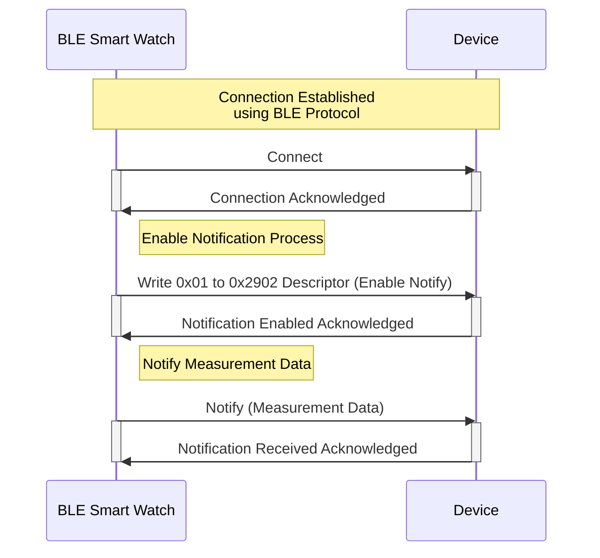

# WISH Smart Watch BLE Data Communication

Documentation for the BLE communication between the WISH Smart Watch and other devices.

## UUIDs

| Name                       | UUID                                   | Description                                          |
| -------------------------- | -------------------------------------- | ---------------------------------------------------- |
| Measurement Service        | `a1b20000-e5f6-7890-1234-56789abcdef0` | Service for sending measurement data                 |
| Temperature Characteristic | `a1b20001-e5f6-7890-1234-56789abcdef0` | Characteristic for sending temperature data (NOTIFY) |
| Humidity Characteristic    | `a1b20002-e5f6-7890-1234-56789abcdef0` | Characteristic for sending humidity data (NOTIFY)    |
| Pressure Characteristic    | `a1b20003-e5f6-7890-1234-56789abcdef0` | Characteristic for sending pressure data (NOTIFY)    |

## Packet Format

| Delimiter | Payload Length | Payload | CRC16/AUG-CCITT | Delimiter |
| --------- | -------------- | ------- | --------------- | --------- |
| 0x7E      | 1 byte         | N bytes | 2 bytes         | 0x7E      |

## Payload Data Types

| Measurement Type | Data Type | Description                          |
| ---------------- | --------- | ------------------------------------ |
| Temperature      | float     | Temperature in Celsius               |
| Heart Rate       | uint8_t   | Heart rate in BPM                    |
| Accelerometer    | float[3]  | Acceleration (m/s^2) in X, Y, Z axis |

## Example Packet

- Temperature

```
7E 04 A9 87 FC 41 31 88 7E
```

| Delimiter | Payload Length | Payload     | CRC16/AUG-CCITT | Delimiter |
| --------- | -------------- | ----------- | --------------- | --------- |
| 7E        | 04             | A9 87 FC 41 | 31 88           | 7E        |

- Heart Rate

```
7E 02 75 00 55 50 7E
```

| Delimiter | Payload Length | Payload | CRC16/AUG-CCITT | Delimiter |
| --------- | -------------- | ------- | --------------- | --------- |
| 7E        | 02             | 75 00   | 55 50           | 7E        |

- Accelerometer

```
7E 0C 6B 47 EC 3E A5 6E 6C BF F2 84 1D 41 C1 E0 7E
```

| Delimiter | Payload Length | Payload                             | CRC16/AUG-CCITT | Delimiter |
| --------- | -------------- | ----------------------------------- | --------------- | --------- |
| 7E        | 0C             | 6B 47 EC 3E A5 6E 6C BF F2 84 1D 41 | C1 E0           | 7E        |

## Choosing Measurement Characteristics

To choose which measurement characteristics to enable, write the corresponding value to the 0x2902 descriptor of the characteristic:

- Enable Temperature Notifications: Write `0x01` to `a1b20001-e5f6-7890-1234-56789abcdef0`
- Enable Humidity Notifications: Write `0x01` to `a1b20002-e5f6-7890-1234-56789abcdef0`
- Enable Pressure Notifications: Write `0x01` to `a1b20003-e5f6-7890-1234-56789abcdef0`

## Sequence Diagram for BLE Communication


